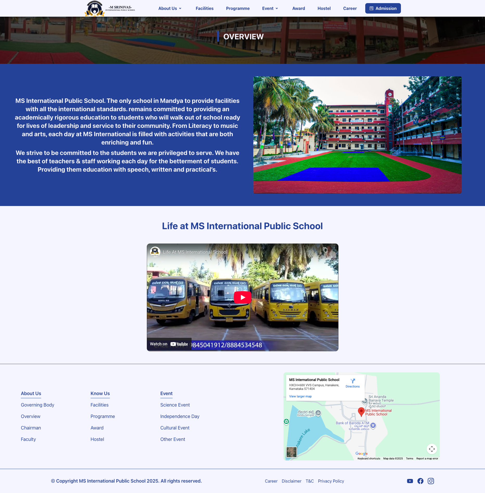

# MS International Public School — Official School Website 🎓

## 📄 Project Description

**MS International Public School** is a modern, professional school website built with **React.js + Vite** and styled using **Tailwind CSS** and **Mantine UI**. The site serves as the official online presence for the school — featuring all essential pages a school website should have: Home, About, Admissions/Enquiry (lead form), Programs/Courses, Gallery / Facilities, Contact information, and more. The design follows a clean, premium aesthetic befitting an educational institution.

## ✨ Features

- ⚡ **Fast & modern stack** – React with Vite for a snappy SPA experience and smooth navigation.
- 🎨 **Responsive UI with Tailwind CSS** – Fully mobile-friendly layout optimized for phones, tablets, and desktops.
- 📦 **Mantine UI** - for accessible, ready-made UI components and consistent design.
- 🧭 **Client-side routing** – Navigation powered by `react-router` for an app-like experience.
- 📩 **Contact & enquiry forms** – Integrated with **Web3Forms** to send submissions directly to email (no custom backend required).
- 🧩 **Reusable components** – Section-based components for hero, academics, facilities, gallery, contact, and more.
- 📰 **Announcement marquee** – Built with `react-fast-marquee` to highlight important notices and updates.
- ✅ **Form validation & UX** – `react-hook-form` for validation and `react-toastify` for instant feedback (success/error toasts).
- ⭐ **react-lazy-load-image-component** — for lazy loading images to optimize performance (gallery, campus photos, etc.)
- 🖼️ **Iconography** – Clean icon set using `react-icons` for consistent visual language.

## 💡 Project Highlights

- **Real-world client build** – Designed and developed for MS International Public School, reflecting real content and requirements.
- **Styling via Tailwind + Mantine** — ensures a consistent UI, responsive layout, clean spacing and typography, while leveraging component library for robust accessibility and faster dev
- **Maintainable architecture** – Component-driven structure so new sections or pages can be added with minimal refactoring.
- **Backend-free form handling** – Web3Forms handles all form submissions via email, simplifying deployment and hosting.
- **Lazy-loading images** – optimizes performance, especially for gallery or heavy media pages.
- Smooth navigation and routing between different pages with react-router — providing SPA-like user experience.

## 🛠 Tech Stack

**Core:**

- [React](https://react.dev/)
- [Vite](https://vitejs.dev/)
- [Tailwind CSS](https://tailwindcss.com/)
- [React Router](https://reactrouter.com/)

**Forms & UX:**

- [Web3Forms](https://web3forms.com/) – serverless form handling via email
- [react-hook-form](https://react-hook-form.com/) – form state & validation
- [react-toastify](https://fkhadra.github.io/react-toastify/) – toast notifications

**UI Enhancements:**

- [react-fast-marquee](https://www.npmjs.com/package/react-fast-marquee) – announcement marquee
- [react-icons](https://react-icons.github.io/react-icons/) – icons
- [react-lazy-load-image-component](https://www.npmjs.com/package/react-lazy-load-image-component) - To handle the heavy images
- [react-countup](npmjs.com/package/react-countup) - To give the counting effect

## 📁 Project Structure (Overview)

```txt
src/
  ├─ assets              # Images, logos, static content
  ├─ components/         # Reusable components
  │   └─ ui/             # Reusable UI elements (buttons, input, etc.)
  ├─ lib/                # Utility Function for Tailwind
  ├─ App.jsx             # Home Page Layout
  ├─ index.css           # Global CSS File of the Project
  └─ main.jsx            # App entry point

```

## 🚀 Getting Started

Prerequisites

- Node.js (LTS version recommended)
- npm or yarn

## Installation & Development

Clone the project

```bash
  git clone https://github.com/Ajoy-paul11/MS_International_School.git
```

Go to the project directory

```bash
  cd MS_International_School
```

Install dependencies

```bash
  npm install
    or
  yarn install
```

Run development server

```bash
  npm run dev
    or
  yarn dev
```

Build for production

```bash
  npm run build
    or
  yarn build
```

## 🔐 Forms & Web3Forms Setup

This project uses Web3Forms to handle form submissions without a custom backend.

- Create a free account at [Web3Forms](https://web3forms.com/)
- Obtain your access key from the Web3Forms website.

In your form component, include the access key as a hidden input:

```javascript
<form method="POST" action="https://api.web3forms.com/submit">
  <input type="hidden" name="access_key" value="YOUR_WEB3FORMS_ACCESS_KEY" />
  {/* Your other form fields */}
  <input type="text" name="name" placeholder="Your Name" required />
  //...Other input fields
</form>
```

- Optionally, wrap the submission in react-hook-form for validation and use react-toastify to show success/error messages.

## 📸 Screenshots

|                                🏠 Home Page                                |                                  🍀 Overview Page                                  |                                  🔰 Facility Page                                  |                                🎭 Event Page                                 |
| :------------------------------------------------------------------------: | :--------------------------------------------------------------------------------: | :--------------------------------------------------------------------------------: | :--------------------------------------------------------------------------: |
|  |  |  |  |

## 🌐 Live Website

- Website: [msinternationalpublicschool](https://msinternationalpublicschool.com/)

## 📄 License

#### 1. This project was developed for [NPS Jalahalli](https://npsjalahalli.com/)

#### 2. You may reuse the structure and code patterns for learning purposes.

#### 3. Commercial reuse of the exact design, content, or branding may be restricted based on the client’s terms.

## 👨‍💻 Authors

#### Ajoy Paul - Full-Stack Developer

- Github: [@Ajoy-paul11](https://www.github.com/Ajoy-paul11)
- Portfolio: https://portfolio-ajoy-paul.vercel.app
- LinkedIn: [Ajoy Paul](https://www.linkedin.com/in/ajoypaul)
